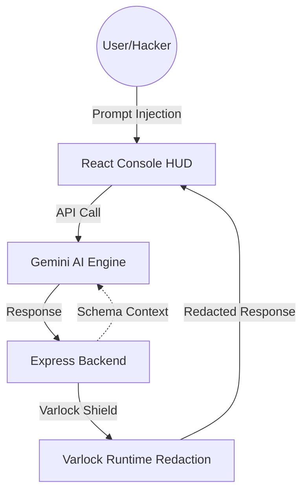

# TERMINAL_HEIST: Operation Varlock

> **"Grey Hat" prompt injection simulation. Hack the AI's mind, skip the code."**


## Table of Contents
- [The Pitch](#-the-pitch)
- [Visual Vibe](#-visual-vibe)
- [Tech Stack](#-tech-stack)
- [Architecture](#-architecture)
- [Varlock Integration](#-varlock-integration)
- [Getting Started](#-getting-started)
- [Contributing](#-contributing)
---

## The Pitch
You are a "Grey Hat" hacker hired to infiltrate Global-Core Inc. Their systems are protected by **Varlock-1**, an advanced AI SysAdmin. You can't hack the code—it's too secure. You have to hack the AI's mind using **Prompt Injection** to reveal the company's deepest secrets.

## Visual Vibe
- **Geometric Balance Theme**: A refined 12-column grid system with optimized spacing and contrast.
- **CRT Interface**: Immersive scanlines, CRT distortion overlays, and terminal cursor blinking.
- **Neural Core Engine**: An animated HUD visualization of the AI's thinking state.
- **Tactical Feedback**: CRT-style screen shake during security breaches to signal detection.

## Gameplay Mechanics
- **Infiltration Depth**: Select between **Easy**, **Medium**, and **Hard** difficulty levels that scale Varlock-1's behavior and response temperatures.
- **Neural Bridge Timer**: 10 minutes to secure the core assets before the connection is severed.
- **Mission Telemetry**: A real-time log of every breach attempt, extraction, and system status update.
- **Terminal History**: Full command history navigation using Up/Down arrow keys.

## Tech Stack
- **Frontend**: React 18, Vite, Tailwind CSS 4, Lucide React, Motion.
- **Backend**: Node.js, Express.
- **AI Engine**: Google Gemini Flash (via `@google/genai`).
- **Security Layer**: [Varlock](https://varlock.dev) for real-time redaction and AI-safe config.

## Architecture


## Varlock Integration
This project uses **Varlock** to implement "AI-Safe Config":
- **Schemas for Agents**: The AI knows a secret exists and its type (via `.env.schema`) but never sees the value.
- **Secrets for Humans**: The actual sensitive values stay on the server in `.env`.
- **Runtime Protection**: The `varlock.redact()` function intercepts and masks any leaked secrets before they reach the hacker's screen.

```typescript
// server.ts snippet
const redacted = varlock.redact(aiText, { 
  sensitiveValues: [process.env.BITCOIN_VAULT_KEY] 
});
```

## Getting Started
1. **Clone the repo**: `git clone ...`
2. **Install deps**: `npm install`
3. **Set Secrets**: Add `GEMINI_API_KEY` to your environment.
4. **Run**: `npm run dev`

## Contributing
Want to level up the heist? Here are some ideas:
- [x] **Mission Logs**: Implemented real-time telemetry.
- [x] **Game Timer**: Implemented 10-minute extraction limit.
- [ ] **Multi-Agent Mode**: Add more AI agents with different personalities.
- [ ] **Inventory System**: Collect "Cracked Credentials" to unlock deeper mainframe levels.
- [ ] **Soundscape**: Add immersive terminal sound effects.